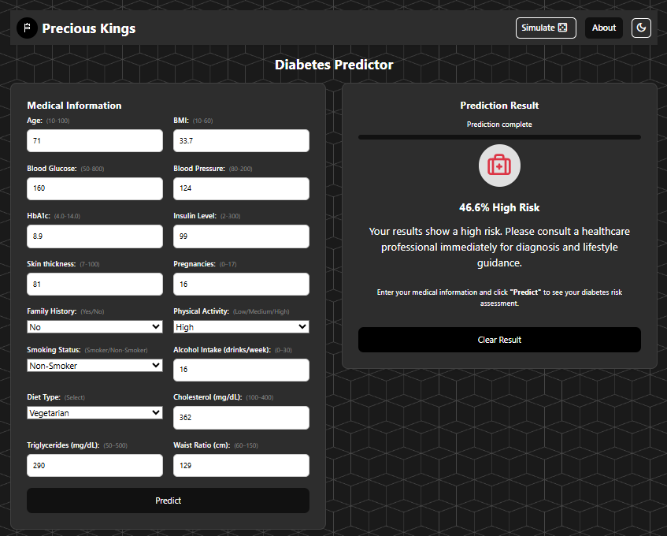

# Diabetes Predictor

An advanced web application for predicting diabetes risk and progression using machine learning models.

<div style="text-align: center; margin-bottom: 10px;">
  <a href="https://diabetes-predictor-li8h.onrender.com" target="_blank">
    
  </a>
</div>

## Live Demo

Try the application here:  
[Diabetes Predictor Web App](https://diabetes-predictor-li8h.onrender.com)

## Key Features

- **Advanced Risk Assessment**: Utilizes both XGBoost models and medical criteria for accurate risk prediction
- **Dual Prediction System**:
  - Risk Level Classification (Fair, Moderate, High)
  - Disease Progression Probability
- **Comprehensive Health Metrics**:
  - HbA1c levels
  - Blood glucose measurements
  - Medical history tracking
  - Demographic factors
- **Smart Risk Scoring**:
  - Weighted scoring system based on medical criteria
  - Real-time risk calculation
  - Personalized health advice
- **User-Friendly Interface**:
  - Intuitive form input
  - Dark/Light mode support
  - Responsive design
- **Detailed Results**:
  - Risk classification with explanation
  - Progression warnings when applicable
  - Tailored medical advice

## Technologies Used

### Backend

- Python 3.x
- Flask (Web Framework)
- XGBoost (Machine Learning)
- scikit-learn (Data Processing)
- Pandas (Data Handling)

### Frontend

- HTML5/CSS3
- JavaScript
- Bootstrap 5
- Custom responsive design

### Development & Deployment

- Docker support
- Render deployment configuration
- Continuous Integration ready

## Advanced Features

### Risk Assessment System

The application uses a sophisticated dual-model approach:

1. **XGBoost Risk Model**: Classifies patients into risk categories
2. **XGBoost Progression Model**: Predicts likelihood of condition worsening
3. **Medical Criteria Scoring**: Evaluates:
   - HbA1c levels (highest weight)
   - Blood glucose readings
   - Hospital visit frequency
   - Medication count
   - Age factor

### Data Processing Pipeline

- Automated data preprocessing
- Feature engineering
- Standardization
- Missing value handling

## Setup Instructions

1. Clone the repository:

   ```sh
   git clone https://github.com/Longman-max/diabetes-predictor.git
   cd diabetes-predictor
   ```

2. Create and activate a virtual environment:

   ```sh
   python -m venv .venv
   # On Windows:
   .venv\Scripts\activate
   # On macOS/Linux:
   source .venv/bin/activate
   ```

3. Install dependencies:

   ```sh
   pip install -r requirements.txt
   ```

4. Train the models (optional - pre-trained models included):

   ```sh
   python train_model.py
   ```

5. Run the application:

   ```sh
   python app.py
   ```

6. Open your browser and navigate to `http://127.0.0.1:5000/`

## Project Structure

```
├── app.py                 # Main Flask application
├── train_model.py         # Model training script
├── data/                  # Dataset directory
├── xgboostmodel/         # Trained models
│   ├── xgb_risk_model.pkl
│   ├── xgb_prog_model.pkl
│   ├── pipeline.pkl
│   └── columns.pkl
├── static/               # Static assets
│   ├── css/             # Stylesheets
│   ├── js/              # JavaScript files
│   └── images/          # Image assets
├── templates/            # HTML templates
├── notebooks/           # Jupyter notebooks
└── docs/                # Documentation
```

## Model Details

The system employs two XGBoost models:

1. **Risk Classification Model**

   - Predicts risk levels: Fair, Moderate, High
   - Incorporates medical criteria scoring
   - Uses feature importance for key health indicators

2. **Progression Model**
   - Predicts likelihood of condition worsening
   - Provides early warning system
   - Based on historical progression patterns

## Contributing

Contributions are welcome! Please feel free to submit a Pull Request.

## License

This project is available for educational and research purposes.

## Acknowledgments

- Medical criteria and risk factors based on established diabetes research
- Dataset sourced from verified medical records
- Implementation inspired by best practices in medical risk assessment
